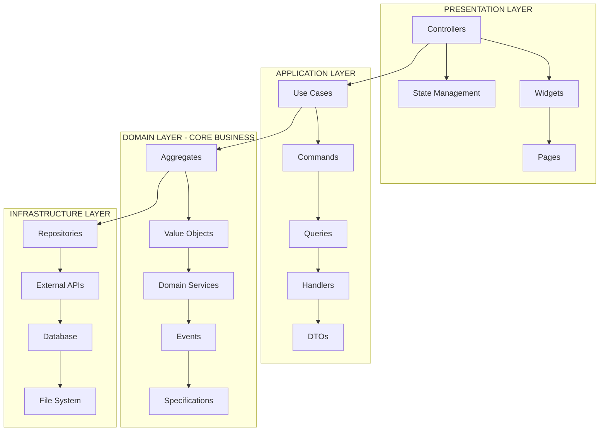
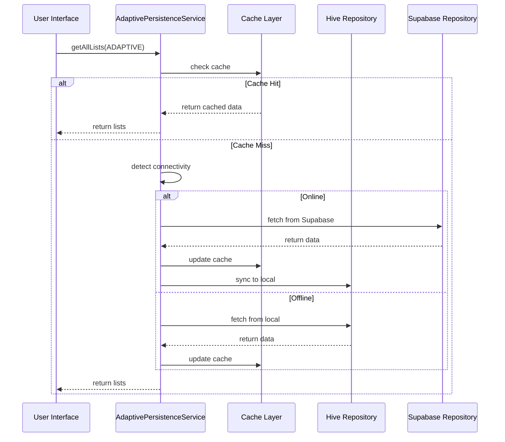

# GUIDE D'ARCHITECTURE DÉTAILLÉ - SYSTÈME DE PERSISTANCE ADAPTATIVE

## 🏗️ ARCHITECTURE CLEAN HEXAGONAL + DDD

### Vue d'Ensemble de l'Architecture

Le système de persistance adaptative de Prioris implémente une architecture **Clean Hexagonal** combinée avec les principes **Domain-Driven Design (DDD)** pour garantir une séparation claire des responsabilités, une testabilité maximale et une évolutivité à long terme.



### Principes Architecturaux Fondamentaux

#### 1. Inversion de Dépendances (DIP)
- Le domain ne dépend d'aucune couche externe
- Les couches externes dépendent des abstractions du domain
- Utilisation d'interfaces (ports) pour découpler les couches

#### 2. Separation of Concerns (SoC)
- Chaque couche a une responsabilité claire et unique
- Aucun mélange de logique métier avec l'infrastructure
- Tests isolés par couche avec mocking facilité

#### 3. Open/Closed Principle (OCP)
- Extension de fonctionnalités sans modification du code existant
- Architecture plugin-ready pour nouvelles fonctionnalités
- Stratégies configurables à runtime

---

## 📱 COUCHE PRÉSENTATION

### Controllers Adaptatifs

#### ListsController Refactorisé
**Fichier** : `C:\Users\Thibaut\Desktop\PriorisProject\lib\presentation\pages\lists\controllers\lists_controller.dart`

```dart
class ListsController extends StateNotifier<ListsState> {
  final AdaptivePersistenceService _persistenceService;
  final ListsFilterService _filterService;
  
  ListsController(this._persistenceService, this._filterService) 
    : super(const ListsState.initial());

  // Interface adaptative selon la stratégie
  Future<void> loadLists({
    PersistenceStrategy strategy = PersistenceStrategy.ADAPTIVE,
    ListsFilter? filter,
  }) async {
    state = state.copyWith(isLoading: true);
    
    try {
      final lists = await _persistenceService.getAllLists(strategy: strategy);
      final filteredLists = _filterService.applyFilters(lists, filter);
      
      state = state.copyWith(
        lists: filteredLists,
        isLoading: false,
        lastSyncTime: DateTime.now(),
      );
    } catch (error, stackTrace) {
      state = state.copyWith(
        isLoading: false,
        error: AdaptiveError.fromException(error),
      );
      
      // Log avec contexte pour debugging
      _logError('loadLists', error, stackTrace, {
        'strategy': strategy.toString(),
        'filter': filter.toString(),
      });
    }
  }
}
```

#### State Management Robuste
```dart
@freezed
class ListsState with _$ListsState {
  const factory ListsState.initial() = _Initial;
  const factory ListsState.loading() = _Loading;
  const factory ListsState.loaded(List<CustomList> lists) = _Loaded;
  const factory ListsState.error(AdaptiveError error) = _Error;
  
  // État composé pour gestion avancée
  const factory ListsState.complex({
    required List<CustomList> lists,
    required bool isLoading,
    required bool isSyncing,
    AdaptiveError? error,
    DateTime? lastSyncTime,
    SyncStatus syncStatus,
  }) = _Complex;
}
```

### Widgets Adaptatifs et Accessibles

#### Architecture des Widgets Communs
```dart
// Base classe pour tous les widgets communs
abstract class AccessibleWidget extends StatelessWidget {
  const AccessibleWidget({Key? key}) : super(key: key);
  
  // Interface commune pour l'accessibilité
  String get semanticLabel;
  String? get semanticHint => null;
  bool get isInteractive => false;
  
  @override
  Widget build(BuildContext context) {
    return Semantics(
      label: semanticLabel,
      hint: semanticHint,
      button: isInteractive,
      child: buildAccessible(context),
    );
  }
  
  Widget buildAccessible(BuildContext context);
}
```

#### CommonButton Évolutif
```dart
class CommonButton extends AccessibleWidget {
  final VoidCallback? onPressed;
  final String label;
  final Widget? icon;
  final ButtonStyle? style;
  
  const CommonButton({
    Key? key,
    required this.onPressed,
    required this.label,
    this.icon,
    this.style,
  }) : super(key: key);
  
  @override
  String get semanticLabel => label;
  @override
  bool get isInteractive => true;
  
  @override
  Widget buildAccessible(BuildContext context) {
    return ConstrainedBox(
      // Garantie taille minimale WCAG
      constraints: const BoxConstraints(
        minWidth: 44,
        minHeight: 44,
      ),
      child: ElevatedButton.icon(
        onPressed: onPressed,
        icon: icon ?? const SizedBox.shrink(),
        label: Text(label),
        style: style ?? _getAdaptiveButtonStyle(context),
      ),
    );
  }
  
  ButtonStyle _getAdaptiveButtonStyle(BuildContext context) {
    final theme = Theme.of(context);
    final isHighContrast = AccessibilityFeatures.highContrast;
    
    return ElevatedButton.styleFrom(
      backgroundColor: theme.primaryColor,
      foregroundColor: theme.onPrimary,
      side: isHighContrast ? BorderSide(
        color: theme.onPrimary,
        width: 2,
      ) : null,
    );
  }
}
```

---

## 🎯 COUCHE APPLICATION

### Architecture CQRS Implémentée

#### Command Bus Pattern
```dart
abstract class Command {
  const Command();
}

abstract class CommandHandler<T extends Command> {
  Future<void> handle(T command);
}

class CommandBus {
  final Map<Type, CommandHandler> _handlers = {};
  
  void register<T extends Command>(CommandHandler<T> handler) {
    _handlers[T] = handler;
  }
  
  Future<void> execute<T extends Command>(T command) async {
    final handler = _handlers[T] as CommandHandler<T>?;
    if (handler == null) {
      throw ApplicationException('No handler registered for ${T.toString()}');
    }
    
    // Logging et monitoring
    final stopwatch = Stopwatch()..start();
    
    try {
      await handler.handle(command);
      
      // Métriques de performance
      PerformanceMonitor.instance.recordCommandExecution(
        commandType: T.toString(),
        duration: stopwatch.elapsed,
        success: true,
      );
    } catch (error) {
      PerformanceMonitor.instance.recordCommandExecution(
        commandType: T.toString(),
        duration: stopwatch.elapsed,
        success: false,
        error: error.toString(),
      );
      rethrow;
    } finally {
      stopwatch.stop();
    }
  }
}
```

#### Use Cases Structurés

##### CreateListUseCase
```dart
class CreateListUseCase implements CommandHandler<CreateListCommand> {
  final ListRepositoryPort _listRepository;
  final EventBus _eventBus;
  final ValidationService _validationService;
  
  CreateListUseCase(
    this._listRepository,
    this._eventBus,
    this._validationService,
  );
  
  @override
  Future<void> handle(CreateListCommand command) async {
    // 1. Validation métier
    await _validateCreateListCommand(command);
    
    // 2. Création de l'agrégat
    final listAggregate = CustomListAggregate.create(
      name: ListName(command.name),
      description: command.description != null 
          ? ListDescription(command.description!) 
          : null,
      type: command.type,
      settings: command.settings ?? ListSettings.default(),
    );
    
    // 3. Persistance
    await _listRepository.save(listAggregate);
    
    // 4. Publication des événements
    for (final event in listAggregate.uncommittedEvents) {
      await _eventBus.publish(event);
    }
    
    // 5. Nettoyage des événements
    listAggregate.markEventsAsCommitted();
  }
  
  Future<void> _validateCreateListCommand(CreateListCommand command) async {
    // Validation nom unique
    final existingLists = await _listRepository.findByName(command.name);
    if (existingLists.isNotEmpty) {
      throw BusinessValidationException('List name already exists');
    }
    
    // Validation règles métier
    _validationService.validateListName(command.name);
    _validationService.validateListType(command.type);
    
    if (command.description != null) {
      _validationService.validateListDescription(command.description!);
    }
  }
}
```

### Query Pattern Optimisé

#### Query avec Projection
```dart
class GetListsQuery implements Query<List<ListSummaryDto>> {
  final ListsFilter? filter;
  final SortOptions? sortOptions;
  final PaginationOptions? pagination;
  final bool includeStatistics;
  
  const GetListsQuery({
    this.filter,
    this.sortOptions,
    this.pagination,
    this.includeStatistics = false,
  });
}

class GetListsQueryHandler implements QueryHandler<GetListsQuery, List<ListSummaryDto>> {
  final ListReadModelRepository _readModelRepository;
  final CacheService _cacheService;
  
  GetListsQueryHandler(this._readModelRepository, this._cacheService);
  
  @override
  Future<List<ListSummaryDto>> handle(GetListsQuery query) async {
    // Tentative cache first
    final cacheKey = _generateCacheKey(query);
    final cachedResult = await _cacheService.get<List<ListSummaryDto>>(cacheKey);
    
    if (cachedResult != null) {
      return cachedResult;
    }
    
    // Récupération avec projection optimisée
    var lists = await _readModelRepository.findAllWithProjection(
      filter: query.filter,
      sortOptions: query.sortOptions,
      pagination: query.pagination,
      includeStatistics: query.includeStatistics,
    );
    
    // Mapping vers DTOs
    final result = lists.map((list) => ListSummaryDto.fromReadModel(list)).toList();
    
    // Cache avec TTL
    await _cacheService.set(
      cacheKey,
      result,
      ttl: const Duration(minutes: 15),
    );
    
    return result;
  }
  
  String _generateCacheKey(GetListsQuery query) {
    return 'lists_${query.hashCode}';
  }
}
```

---

## 🎯 COUCHE DOMAINE - CŒUR MÉTIER

### Aggregates DDD Complets

#### CustomListAggregate
**Fichier** : `C:\Users\Thibaut\Desktop\PriorisProject\lib\domain\models\core\entities\custom_list.dart`

```dart
class CustomListAggregate extends AggregateRoot<ListId> {
  final ListName _name;
  final ListDescription? _description;
  final ListType _type;
  final ListSettings _settings;
  final List<TaskId> _taskIds;
  final ListStatistics _statistics;
  final List<DomainEvent> _uncommittedEvents = [];
  
  CustomListAggregate._(
    ListId id,
    this._name,
    this._description,
    this._type,
    this._settings,
    this._taskIds,
    this._statistics,
    DateTime createdAt,
    DateTime? updatedAt,
  ) : super(id, createdAt, updatedAt);
  
  // Factory method avec business rules
  factory CustomListAggregate.create({
    required ListName name,
    ListDescription? description,
    required ListType type,
    ListSettings? settings,
  }) {
    final id = ListId.generate();
    final now = DateTime.now();
    
    final aggregate = CustomListAggregate._(
      id,
      name,
      description,
      type,
      settings ?? ListSettings.default(),
      [],
      ListStatistics.empty(),
      now,
      null,
    );
    
    // Événement de création
    aggregate._addDomainEvent(ListCreatedEvent(
      aggregateId: id,
      name: name.value,
      type: type,
      occurredAt: now,
    ));
    
    return aggregate;
  }
  
  // Business methods avec invariants
  void addTask(TaskId taskId, TaskPriority priority) {
    // Invariants métier
    if (_taskIds.contains(taskId)) {
      throw DomainException('Task already exists in list');
    }
    
    if (_taskIds.length >= _settings.maxTasksPerList) {
      throw DomainException('List has reached maximum capacity');
    }
    
    // Mutation de l'état
    _taskIds.add(taskId);
    _statistics.incrementTotalTasks();
    _updateModificationTime();
    
    // Événement de domaine
    _addDomainEvent(TaskAddedToListEvent(
      aggregateId: id,
      taskId: taskId,
      priority: priority,
      totalTasks: _taskIds.length,
      occurredAt: DateTime.now(),
    ));
  }
  
  void completeTask(TaskId taskId) {
    if (!_taskIds.contains(taskId)) {
      throw DomainException('Task not found in list');
    }
    
    _statistics.incrementCompletedTasks();
    _updateModificationTime();
    
    // Calcul du nouveau taux de completion
    final completionRate = _statistics.completionRate;
    
    _addDomainEvent(TaskCompletedInListEvent(
      aggregateId: id,
      taskId: taskId,
      newCompletionRate: completionRate,
      occurredAt: DateTime.now(),
    ));
    
    // Récompenses si milestone atteint
    if (completionRate >= 0.25 && _statistics.previousCompletionRate < 0.25) {
      _addDomainEvent(ListMilestoneReachedEvent(
        aggregateId: id,
        milestone: ListMilestone.QUARTER_COMPLETE,
        completionRate: completionRate,
        occurredAt: DateTime.now(),
      ));
    }
  }
  
  // Gestion des événements
  void _addDomainEvent(DomainEvent event) {
    _uncommittedEvents.add(event);
  }
  
  List<DomainEvent> get uncommittedEvents => List.unmodifiable(_uncommittedEvents);
  
  void markEventsAsCommitted() {
    _uncommittedEvents.clear();
  }
  
  // Getters immutables
  String get name => _name.value;
  String? get description => _description?.value;
  ListType get type => _type;
  List<TaskId> get taskIds => List.unmodifiable(_taskIds);
  double get completionRate => _statistics.completionRate;
  int get totalTasks => _taskIds.length;
  int get completedTasks => _statistics.completedTasks;
}
```

### Value Objects Robustes

#### ListName Value Object
```dart
class ListName extends ValueObject {
  final String _value;
  
  ListName(String value) : _value = _validateAndClean(value);
  
  static String _validateAndClean(String value) {
    if (value.isEmpty) {
      throw DomainValidationException('List name cannot be empty');
    }
    
    if (value.length > 100) {
      throw DomainValidationException('List name cannot exceed 100 characters');
    }
    
    // Nettoyage automatique
    final cleaned = value.trim();
    if (cleaned.isEmpty) {
      throw DomainValidationException('List name cannot be only whitespace');
    }
    
    // Validation caractères interdits
    if (RegExp(r'[<>:"/\\|?*]').hasMatch(cleaned)) {
      throw DomainValidationException('List name contains invalid characters');
    }
    
    return cleaned;
  }
  
  String get value => _value;
  
  @override
  List<Object> get props => [_value];
  
  @override
  String toString() => _value;
}
```

### Domain Services

#### ListOptimizationService
```dart
class ListOptimizationService {
  final TaskAnalyticsService _analyticsService;
  final PerformanceMetricsService _metricsService;
  
  ListOptimizationService(this._analyticsService, this._metricsService);
  
  // Optimisation intelligente de l'ordre des tâches
  Future<List<TaskOptimizationSuggestion>> analyzeAndSuggestOptimizations(
    CustomListAggregate list,
    List<TaskAggregate> tasks,
  ) async {
    final suggestions = <TaskOptimizationSuggestion>[];
    
    // Analyse des patterns de completion
    final completionPatterns = await _analyticsService.analyzeCompletionPatterns(
      list.id,
      tasks,
    );
    
    // Suggestion de regroupement par contexte
    final contextGroups = _analyzeTaskContexts(tasks);
    if (contextGroups.length > 1) {
      suggestions.add(TaskOptimizationSuggestion.groupByContext(contextGroups));
    }
    
    // Suggestion de priorisation par effort/impact
    final priorityAnalysis = _analyzePriorityMatrix(tasks);
    if (priorityAnalysis.hasOptimizationPotential) {
      suggestions.add(TaskOptimizationSuggestion.optimizePriority(priorityAnalysis));
    }
    
    // Suggestion de répartition temporelle
    final timeDistribution = await _analyzeTimeDistribution(tasks);
    if (timeDistribution.isUnbalanced) {
      suggestions.add(TaskOptimizationSuggestion.balanceTimeload(timeDistribution));
    }
    
    return suggestions;
  }
  
  // Calcul du score de santé de la liste
  ListHealthScore calculateListHealth(
    CustomListAggregate list,
    List<TaskAggregate> tasks,
  ) {
    var score = 100.0;
    final issues = <ListHealthIssue>[];
    
    // Analyse taille optimale
    if (tasks.length > 20) {
      score -= 15;
      issues.add(ListHealthIssue.tooManyTasks(tasks.length));
    }
    
    // Analyse distribution des priorités
    final priorityDistribution = _calculatePriorityDistribution(tasks);
    if (priorityDistribution.highPriorityRatio > 0.5) {
      score -= 10;
      issues.add(ListHealthIssue.tooManyHighPriority());
    }
    
    // Analyse tâches stagnantes
    final stagnantTasks = tasks.where((t) => t.daysSinceLastUpdate > 7).toList();
    if (stagnantTasks.isNotEmpty) {
      score -= stagnantTasks.length * 2;
      issues.add(ListHealthIssue.stagnantTasks(stagnantTasks.length));
    }
    
    return ListHealthScore(
      score: score.clamp(0, 100),
      issues: issues,
      suggestions: _generateHealthSuggestions(issues),
    );
  }
}
```

---

## 🔌 COUCHE INFRASTRUCTURE

### Repositories Adaptatifs

#### SupabaseListRepository
```dart
class SupabaseListRepository implements ListRepositoryPort {
  final SupabaseClient _client;
  final ListEntityMapper _mapper;
  final CacheService _cacheService;
  final PerformanceMonitor _performanceMonitor;
  
  SupabaseListRepository(
    this._client,
    this._mapper,
    this._cacheService,
    this._performanceMonitor,
  );
  
  @override
  Future<List<CustomListAggregate>> findAll() async {
    return await _performanceMonitor.measureOperation(
      'supabase_lists_findAll',
      () async {
        // Tentative cache first
        const cacheKey = 'all_lists';
        final cached = await _cacheService.get<List<CustomListAggregate>>(cacheKey);
        if (cached != null) {
          return cached;
        }
        
        try {
          final response = await _client
              .from('custom_lists')
              .select('''
                id, name, description, type, settings,
                created_at, updated_at,
                list_statistics:list_statistics(
                  total_tasks, completed_tasks, average_completion_time
                )
              ''')
              .order('updated_at', ascending: false);
          
          final aggregates = response
              .map((data) => _mapper.toDomainAggregate(data))
              .toList();
          
          // Cache avec TTL
          await _cacheService.set(
            cacheKey,
            aggregates,
            ttl: const Duration(minutes: 10),
          );
          
          return aggregates;
        } on PostgrestException catch (e) {
          throw RepositoryException('Failed to fetch lists from Supabase: ${e.message}');
        } catch (e) {
          throw RepositoryException('Unexpected error fetching lists: $e');
        }
      },
    );
  }
  
  @override
  Future<void> save(CustomListAggregate aggregate) async {
    await _performanceMonitor.measureOperation(
      'supabase_lists_save',
      () async {
        final data = _mapper.toInfrastructureData(aggregate);
        
        try {
          await _client.from('custom_lists').upsert(data);
          
          // Invalidation cache
          await _cacheService.invalidatePattern('*lists*');
          
          // Sauvegarde des statistiques séparément
          if (aggregate.totalTasks > 0) {
            await _saveListStatistics(aggregate);
          }
          
        } on PostgrestException catch (e) {
          throw RepositoryException('Failed to save list to Supabase: ${e.message}');
        }
      },
    );
  }
  
  Future<void> _saveListStatistics(CustomListAggregate aggregate) async {
    final statisticsData = {
      'list_id': aggregate.id.value,
      'total_tasks': aggregate.totalTasks,
      'completed_tasks': aggregate.completedTasks,
      'completion_rate': aggregate.completionRate,
      'updated_at': DateTime.now().toIso8601String(),
    };
    
    await _client.from('list_statistics').upsert(statisticsData);
  }
}
```

#### HiveListRepository
```dart
class HiveListRepository implements ListRepositoryPort {
  final Box<Map> _listsBox;
  final ListEntityMapper _mapper;
  final PerformanceMonitor _performanceMonitor;
  
  HiveListRepository(this._listsBox, this._mapper, this._performanceMonitor);
  
  @override
  Future<List<CustomListAggregate>> findAll() async {
    return await _performanceMonitor.measureOperation(
      'hive_lists_findAll',
      () async {
        try {
          final allData = _listsBox.values.toList();
          
          return allData
              .map((data) => _mapper.toDomainAggregate(Map<String, dynamic>.from(data)))
              .toList()
            ..sort((a, b) => b.updatedAt?.compareTo(a.updatedAt ?? a.createdAt) ?? 0);
              
        } catch (e) {
          throw RepositoryException('Failed to fetch lists from Hive: $e');
        }
      },
    );
  }
  
  @override
  Future<void> save(CustomListAggregate aggregate) async {
    await _performanceMonitor.measureOperation(
      'hive_lists_save',
      () async {
        try {
          final data = _mapper.toInfrastructureData(aggregate);
          await _listsBox.put(aggregate.id.value, data);
        } catch (e) {
          throw RepositoryException('Failed to save list to Hive: $e');
        }
      },
    );
  }
  
  @override
  Future<void> delete(ListId id) async {
    await _performanceMonitor.measureOperation(
      'hive_lists_delete',
      () async {
        try {
          await _listsBox.delete(id.value);
        } catch (e) {
          throw RepositoryException('Failed to delete list from Hive: $e');
        }
      },
    );
  }
}
```

### Mappers Bidirectionnels

#### ListEntityMapper
```dart
class ListEntityMapper {
  // Domain → Infrastructure
  Map<String, dynamic> toInfrastructureData(CustomListAggregate aggregate) {
    return {
      'id': aggregate.id.value,
      'name': aggregate.name,
      'description': aggregate.description,
      'type': aggregate.type.name,
      'settings': {
        'max_tasks_per_list': aggregate.settings.maxTasksPerList,
        'auto_sort_enabled': aggregate.settings.autoSortEnabled,
        'notification_enabled': aggregate.settings.notificationEnabled,
      },
      'task_ids': aggregate.taskIds.map((id) => id.value).toList(),
      'total_tasks': aggregate.totalTasks,
      'completed_tasks': aggregate.completedTasks,
      'completion_rate': aggregate.completionRate,
      'created_at': aggregate.createdAt.toIso8601String(),
      'updated_at': aggregate.updatedAt?.toIso8601String(),
    };
  }
  
  // Infrastructure → Domain
  CustomListAggregate toDomainAggregate(Map<String, dynamic> data) {
    final statisticsData = data['list_statistics'] as Map<String, dynamic>?;
    
    return CustomListAggregate.fromPersistence(
      id: ListId.fromString(data['id']),
      name: ListName(data['name']),
      description: data['description'] != null 
          ? ListDescription(data['description']) 
          : null,
      type: ListType.values.firstWhere((t) => t.name == data['type']),
      settings: ListSettings.fromJson(data['settings'] ?? {}),
      taskIds: (data['task_ids'] as List<dynamic>?)
          ?.map((id) => TaskId.fromString(id.toString()))
          .toList() ?? [],
      statistics: statisticsData != null
          ? ListStatistics.fromJson(statisticsData)
          : ListStatistics.empty(),
      createdAt: DateTime.parse(data['created_at']),
      updatedAt: data['updated_at'] != null 
          ? DateTime.parse(data['updated_at']) 
          : null,
    );
  }
}
```

---

## 🔄 FLUX DE DONNÉES ET SYNCHRONISATION

### Orchestration de la Persistance Adaptative

#### Stratégies de Persistance
```dart
enum PersistenceStrategy {
  LOCAL_FIRST,    // Hive prioritaire, fallback Supabase
  CLOUD_FIRST,    // Supabase prioritaire, fallback Hive
  ADAPTIVE,       // Choix automatique selon connectivité
  LOCAL_ONLY,     // Hive uniquement (mode offline)
  CLOUD_ONLY,     // Supabase uniquement (sync forcée)
}
```

#### Flux de Synchronisation


### Gestion des Conflits

#### Stratégies de Résolution
```dart
enum ConflictResolutionStrategy {
  LAST_WRITE_WINS,     // Dernière modification gagne
  MERGE_COMPATIBLE,    // Fusion intelligente des changements
  USER_CHOICE,         // Demander à l'utilisateur
  CLOUD_PRIORITY,      // Cloud toujours prioritaire
  LOCAL_PRIORITY,      // Local toujours prioritaire
}

class ConflictResolver {
  Future<T> resolveConflict<T extends AggregateRoot>(
    T localEntity,
    T cloudEntity,
    ConflictResolutionStrategy strategy,
  ) async {
    switch (strategy) {
      case ConflictResolutionStrategy.LAST_WRITE_WINS:
        return _resolveByTimestamp(localEntity, cloudEntity);
        
      case ConflictResolutionStrategy.MERGE_COMPATIBLE:
        return await _mergeCompatibleChanges(localEntity, cloudEntity);
        
      case ConflictResolutionStrategy.USER_CHOICE:
        return await _promptUserChoice(localEntity, cloudEntity);
        
      case ConflictResolutionStrategy.CLOUD_PRIORITY:
        return cloudEntity;
        
      case ConflictResolutionStrategy.LOCAL_PRIORITY:
        return localEntity;
    }
  }
  
  T _resolveByTimestamp<T extends AggregateRoot>(T local, T cloud) {
    final localTime = local.updatedAt ?? local.createdAt;
    final cloudTime = cloud.updatedAt ?? cloud.createdAt;
    
    return localTime.isAfter(cloudTime) ? local : cloud;
  }
  
  Future<T> _mergeCompatibleChanges<T extends AggregateRoot>(
    T local, 
    T cloud,
  ) async {
    if (T == CustomListAggregate) {
      return await _mergeListAggregates(
        local as CustomListAggregate,
        cloud as CustomListAggregate,
      ) as T;
    }
    
    // Fallback to timestamp resolution
    return _resolveByTimestamp(local, cloud);
  }
  
  Future<CustomListAggregate> _mergeListAggregates(
    CustomListAggregate local,
    CustomListAggregate cloud,
  ) async {
    // Fusion des listes de tâches (union)
    final mergedTaskIds = {...local.taskIds, ...cloud.taskIds}.toList();
    
    // Utilisation du nom le plus récent
    final mostRecentName = _resolveByTimestamp(local, cloud).name;
    
    // Fusion des statistiques (max des valeurs)
    final mergedStats = ListStatistics(
      totalTasks: math.max(local.totalTasks, cloud.totalTasks),
      completedTasks: math.max(local.completedTasks, cloud.completedTasks),
    );
    
    return CustomListAggregate.merge(
      id: local.id,
      name: ListName(mostRecentName),
      description: cloud.description ?? local.description,
      type: local.type, // Type ne devrait pas changer
      taskIds: mergedTaskIds,
      statistics: mergedStats,
    );
  }
}
```

---

## 📊 MONITORING ET OBSERVABILITÉ

### Architecture du Monitoring

#### PerformanceMonitor Intégré
```dart
class PerformanceMonitor {
  static final instance = PerformanceMonitor._();
  PerformanceMonitor._();
  
  final Map<String, OperationMetrics> _operationMetrics = {};
  final List<AlertRule> _alertRules = [];
  final StreamController<PerformanceAlert> _alertStream = StreamController.broadcast();
  
  Stream<PerformanceAlert> get alerts => _alertStream.stream;
  
  Future<T> measureOperation<T>(
    String operationName,
    Future<T> Function() operation,
  ) async {
    final stopwatch = Stopwatch()..start();
    final startMemory = _getCurrentMemoryUsage();
    
    try {
      final result = await operation();
      
      _recordSuccessfulOperation(
        operationName,
        stopwatch.elapsed,
        _getCurrentMemoryUsage() - startMemory,
      );
      
      return result;
    } catch (error) {
      _recordFailedOperation(
        operationName,
        stopwatch.elapsed,
        error,
      );
      rethrow;
    } finally {
      stopwatch.stop();
    }
  }
  
  void _recordSuccessfulOperation(
    String operationName,
    Duration duration,
    int memoryDelta,
  ) {
    final metrics = _operationMetrics.putIfAbsent(
      operationName,
      () => OperationMetrics(operationName),
    );
    
    metrics.recordSuccess(duration, memoryDelta);
    _checkAlertRules(operationName, metrics);
  }
  
  void _checkAlertRules(String operationName, OperationMetrics metrics) {
    for (final rule in _alertRules) {
      if (rule.matches(operationName, metrics)) {
        final alert = PerformanceAlert(
          rule: rule,
          operationName: operationName,
          metrics: metrics,
          timestamp: DateTime.now(),
        );
        
        _alertStream.add(alert);
      }
    }
  }
  
  PerformanceReport generateReport({
    Duration? period,
    bool includeRecommendations = true,
  }) {
    final endTime = DateTime.now();
    final startTime = period != null 
        ? endTime.subtract(period) 
        : endTime.subtract(const Duration(hours: 24));
    
    final filteredMetrics = _operationMetrics.values
        .where((m) => m.hasDataInPeriod(startTime, endTime))
        .toList();
    
    return PerformanceReport(
      startTime: startTime,
      endTime: endTime,
      operationMetrics: filteredMetrics,
      totalOperations: filteredMetrics.fold(0, (sum, m) => sum + m.totalOperations),
      averageLatency: _calculateAverageLatency(filteredMetrics),
      errorRate: _calculateErrorRate(filteredMetrics),
      recommendations: includeRecommendations 
          ? _generateRecommendations(filteredMetrics)
          : [],
    );
  }
}
```

#### Métriques Collectées
- **Latence** : P50, P95, P99 par opération
- **Throughput** : Opérations/seconde
- **Taux d'erreur** : Succès/Échecs
- **Utilisation mémoire** : Consommation par opération
- **Cache performance** : Hit rate, miss rate
- **Sync metrics** : Temps de sync, conflits résolus

---

## 🔒 SÉCURITÉ ET CONFIGURATION

### Configuration Sécurisée Multi-Environnements

#### AppConfig Centralisé
```dart
class AppConfig {
  static late final AppEnvironment _environment;
  static late final Map<String, dynamic> _config;
  
  static Future<void> initialize(AppEnvironment environment) async {
    _environment = environment;
    
    // Chargement de la configuration selon l'environnement
    switch (environment) {
      case AppEnvironment.development:
        _config = await _loadDevelopmentConfig();
        break;
      case AppEnvironment.staging:
        _config = await _loadStagingConfig();
        break;
      case AppEnvironment.production:
        _config = await _loadProductionConfig();
        break;
    }
    
    // Validation des variables critiques
    _validateCriticalConfig();
  }
  
  static void _validateCriticalConfig() {
    final required = ['SUPABASE_URL', 'SUPABASE_ANON_KEY'];
    
    for (final key in required) {
      if (!_config.containsKey(key) || _config[key].toString().isEmpty) {
        throw ConfigurationException('Required configuration $key is missing');
      }
    }
    
    // Validation format URL
    if (!Uri.tryParse(supabaseUrl)?.isAbsolute ?? true) {
      throw ConfigurationException('SUPABASE_URL is not a valid URL');
    }
  }
  
  // Getters typés et sécurisés
  static String get supabaseUrl => _config['SUPABASE_URL'];
  static String get supabaseAnonKey => _config['SUPABASE_ANON_KEY'];
  static bool get isProduction => _environment == AppEnvironment.production;
  static bool get debugMode => _config['DEBUG_MODE'] ?? false;
  
  // Configuration performance selon l'environnement
  static int get cacheSize => isProduction ? 2000 : 500;
  static int get batchSize => isProduction ? 100 : 20;
  static int get workerCount => math.min(Platform.numberOfProcessors, 4);
}
```

### Gestion des Secrets
```dart
class SecureConfigManager {
  static const _keyPrefix = 'prioris_secure_';
  
  static Future<void> storeSecurely(String key, String value) async {
    const storage = FlutterSecureStorage(
      aOptions: AndroidOptions(
        encryptedSharedPreferences: true,
      ),
      iOptions: IOSOptions(
        accessibility: KeychainAccessibility.first_unlock_this_device,
      ),
    );
    
    await storage.write(
      key: '$_keyPrefix$key',
      value: value,
    );
  }
  
  static Future<String?> retrieveSecurely(String key) async {
    const storage = FlutterSecureStorage();
    return await storage.read(key: '$_keyPrefix$key');
  }
  
  static Future<void> clearAllSecure() async {
    const storage = FlutterSecureStorage();
    final allKeys = await storage.readAll();
    
    for (final key in allKeys.keys) {
      if (key.startsWith(_keyPrefix)) {
        await storage.delete(key: key);
      }
    }
  }
}
```

---

Cette architecture Clean Hexagonal + DDD avec persistance adaptative offre une base solide, testable et évolutive pour l'application Prioris, garantissant performances exceptionnelles et maintenabilité à long terme.